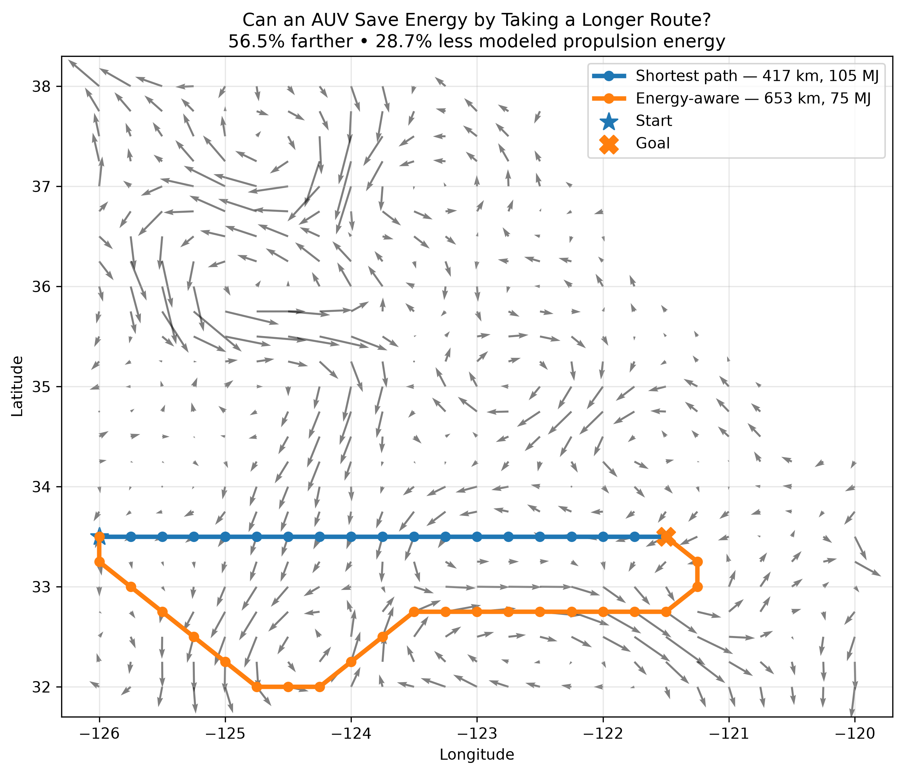

# Current-Aware AUV Path Planning

A path-planning experiment that compares shortest-path routing with current-aware routing for autonomous underwater vehicles using NASA OSCAR ocean-current data.

## Overview

Traditional path planning minimizes geometric distance. For an underwater vehicle, however, the shortest route may not require the least propulsion energy when ocean currents assist or oppose its motion.

This project asks:

> Can an autonomous underwater vehicle reduce modeled propulsion energy by taking a longer route that better uses ocean currents?

The system represents ocean-current data as a geographic grid and compares a baseline A* planner with a current-aware A* planner whose traversal cost incorporates current direction and magnitude.

## Example Result

For one simulated route through a regional NASA OSCAR surface-current field off the California coast in the eastern North Pacific:

| Planner | Distance | Modeled Energy |
| --- | ---: | ---: |
| Baseline A* | 417.3 km | 105.3 MJ |
| Current-aware A* | 653.2 km | 75.0 MJ |

The current-aware route traveled 56.5% farther while using 28.7% less modeled propulsion energy.
This demonstrates the tradeoff explored by the project: minimizing distance and minimizing propulsion energy are not always the same objective.

## Approach

The project separates environmental representation, path planning, and energy estimation into independent components.

- `astar.py` implements baseline A* search.
- `current_aware_astar.py` incorporates ocean currents into traversal cost.
- `energy_model.py` estimates propulsion energy between neighboring grid cells.
- `ocean_grid.py` represents the geographic search space and local current vectors.
- `oscar_loader.py` loads and subsets NASA OSCAR current data.
- `simulation.py` provides utilities for running planner experiments.

For each possible movement, the current-aware planner considers the direction of travel relative to the local ocean-current vector. Favorable currents reduce modeled propulsion effort, while opposing currents increase it.

## Data

The project uses surface-current data from NASA OSCAR.

The demo loads a regional subset off the California coast and converts the current field into a grid containing:

- latitude and longitude coordinates
- east-west current velocity
- north-south current velocity
- traversable ocean cells

Raw OSCAR datasets are kept outside the tracked source code because of their size.

## Repository Structure

```text
current-aware-auv-planning/
├── data/
│   └── raw/
├── notebooks/
│   └── demo.ipynb
├── results/
├── scripts/
│   └── download_oscar_data.py
├── src/
│   └── auv_planning/
│       ├── __init__.py
│       ├── astar.py
│       ├── current_aware_astar.py
│       ├── energy_model.py
│       ├── ocean_grid.py
│       ├── oscar_loader.py
│       └── simulation.py
├── tests/
│   ├── conftest.py
│   ├── test_astar.py
│   ├── test_current_aware_astar.py
│   └── test_energy_model.py
├── .gitignore
├── pyproject.toml
└── README.md
```

## Setup

Clone the repository:

```bash
git clone https://github.com/ananyaathreyas/current-aware-auv-planning.git
cd current-aware-auv-planning
```

Create or activate a Python environment, then install the project:

```bash
python -m pip install -e ".[dev]"
```

Download the OSCAR data:

```bash
python scripts/download_oscar_data.py
```

Open the demo notebook:

```text
notebooks/demo.ipynb
```

The notebook loads the OSCAR current field, runs both planners, compares their paths, and calculates distance and modeled energy consumption.

## Tests

Run the test suite with:

```bash
python -m pytest
```

Tests cover the baseline planner, current-aware planner, and energy model.

## Limitations

This project is a path-planning prototype rather than a full AUV dynamics simulator.

The energy model simplifies real vehicle behavior and does not currently model factors such as:

- vehicle-specific hydrodynamics
- acceleration and turning costs
- depth-dependent currents
- battery behavior
- dynamic obstacles
- uncertainty in future ocean conditions

The reported energy values should therefore be interpreted as comparative model outputs rather than predictions of real-world vehicle energy consumption.

## Future Work

Potential extensions include:

- time-varying current fields
- obstacle-aware routing
- vehicle-specific power models
- larger geographic experiments
- additional planning algorithms
- evaluation across additional start and goal locations

## Author

Ananya Athreyas  
UC Berkeley — Data Science